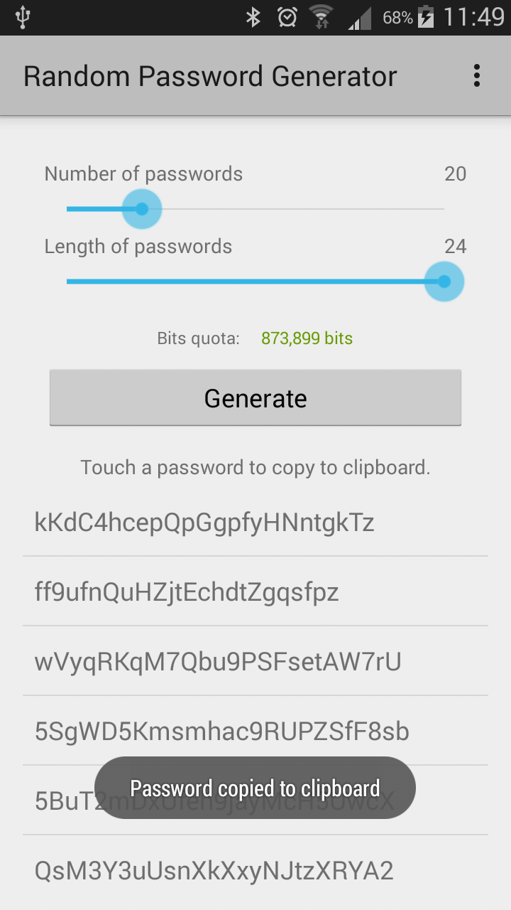
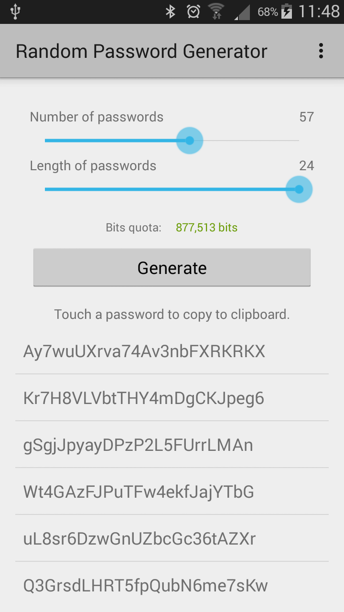
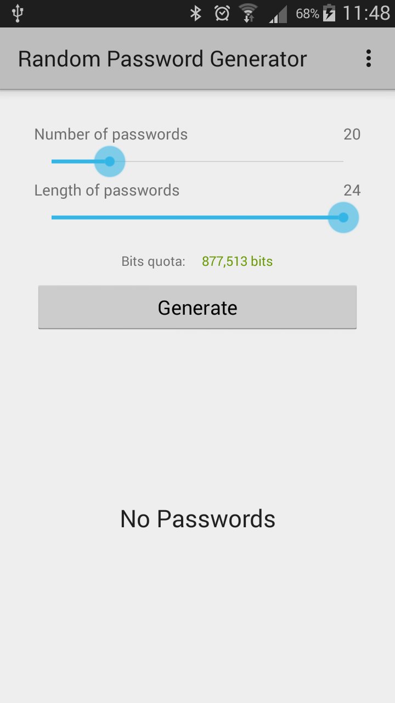

##Random Password Generator

Generate <em>"secure"</em> random passwords with data from <b>RANDOM.ORG</b>, a true random number service that generates randomness via atmospheric noise.

##Srceenshots

 -
 -
 -

##TODO
- Add a app usage instructions.
- Make app even more usable by adding a homescreen widget.
- Add support for languages other than English.

##

